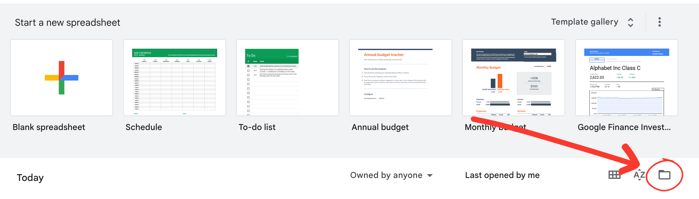

The dataset we are working with is called “2021 Long Form Census - Ward Data”. The census data is publicly available; however, to access this specific dataset, we downloaded a CSV file using the link provided. Once the data is downloaded, we imported its contents to Google Sheets by clicking the folder icon and uploading the file. 

 

Our data after importing:

 

[Link to unclean data](https://docs.google.com/spreadsheets/d/1a1RqAI6Om4i0amPxwzph-R7vnuyw0c5vFZa_4cuVNYc/edit?usp=sharing)
[Link to cleaned data](https://docs.google.com/spreadsheets/d/174ld9pHjfvV7czzBHR_3bJB5Fb4BH9ZPx_SbxSEgNPw/edit?usp=sharing)

Our initial observations pertained to the cleanliness of the data. It was difficult to understand as the meaning of the variables (averages, counts, medians) changed without a clear indication.
These transitions were hard to distinguish from one another as the titles cut off due to their length.
There are 2603 rows, and columns from A-Z, containing the 24 wards across Ottawa. 

Column A contained the characteristics. These spanned several categories such as education, income, and languages. This is categorical data as it is defined by Statistics Canada, “can’t be quantifiable”. (4.2 Types of variables)

Column C-Z belonged to each ward (1-24), while column B refers to the city of Ottawa. Column B-Z contains variables that are both discrete and continuous. 

For example, “The average household size” is equal to 2.5 in column B; this is a continuous value as “it can assume an infinite number of real values within a given interval”, including decimal numbers, yet within a positive range. (4.2 Types of variables) 

An example of a discrete variable is the number of people who spoke a language. There cannot be half a person, thus it will assume “a finite number of real values within a given interval”. (4.2 Types of variables) 

It was surprising to see the extensive list of languages. Several languages were extremely underrepresented. Where did Ottawa fall behind in diversifying the languages spoken? Is this trend reflected in other cities?

The data pertaining to education levels and fields per ward stood out to us. Is there a connection between the fields commonly pursued by wards to the average income? How is the range of education levels so diverse throughout wards? What is being done to address this? 